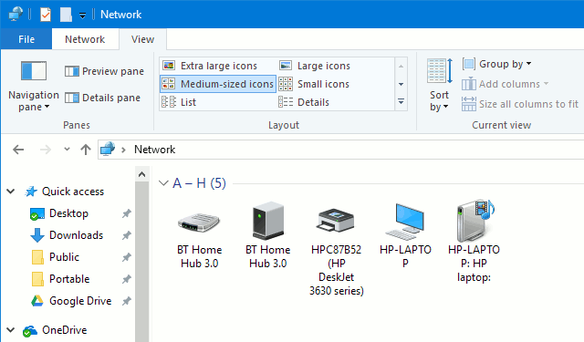

# WiFi Nugget SSDP Phising Demo
This repository contains proof-of-concept code that uses an ESP32-S2 based [WiFi Nugget](https://wifinugget.com) to phish for user credentials over WiFi, by appearing as an inconspicuous network attached camera.  [You can watch the full demo here (coming soon)!](https://youtube.com/Hak5)

## What is SSDP?
[SSDP](https://en.wikipedia.org/wiki/Simple_Service_Discovery_Protocol) is a protocol that allows devices to broadcast their presence on a local network, allowing for easy discovery and management.  [Network attached storage devices (NAS)](https://en.wikipedia.org/wiki/Network-attached_storage), smart-home cameras, printers and other network-connected devices utilize this protocol to make themselves easily found and configurable. 

## What does this repo do?
Using SSDP, the ESP32 / WiFi Nugget broadcasts itself as an inconspicuous network device that appears to be a web camera.  When the user tries to log in and "configure" it, their credentials get phished and logged instead.

This code serves as a simple POC of how SSDP can be used in an ["evil twin"](https://www.google.com/url?sa=t&rct=j&q=&esrc=s&source=web&cd=&ved=2ahUKEwjPm6SvyJ73AhWnKEQIHZTQAzIQFnoECAoQAQ&url=https%3A%2F%2Fipfs.fleek.co%2Fipfs%2FQmXGeJ9pN5XuSXD9xtqqcy56ZJRXsRyuQFU1ZhMBLA4zsf%2Fhacktricks%2Fpentesting%2Fpentesting-network%2Fspoofing-ssdp-and-upnp-devices%2F&usg=AOvVaw25qJMYKWcgywKB-BMczqD5) type of attack, and also is a simple demo to create your own SSDP device.

## How do I try it?
All you need is an [ESP32 WiFi microcontroller]()!  If you want to support our project and follow along with cute cat graphics, you can also buy a [WiFi Nugget](https://wifinugget.com).

<p align="center">
  
  <br>
  <b>WiFi Nugget</b>
  <br>
</p>

Since you'll need to tweak the program to run with your own WiFi credentials, you'll have to compile the Arduino program from scratch.  To do so, you'll need to following libraries:
### Dependencies
- [SH1106 Screen Library](https://github.com/ThingPulse/esp8266-oled-ssd1306)
- [Adafruit NeoPixel Library](https://github.com/adafruit/Adafruit_NeoPixel)
- [ESP32 SSDP Library](https://github.com/luc-github/ESP32SSDP)
- [ESP Async WebServer](https://github.com/me-no-dev/ESPAsyncWebServer)
- [Async TCP Library](https://github.com/me-no-dev/AsyncTCP)

You'll also have to the [WiFi credentials]().


[You can check out our guide here for how to install the libraries in Arduino / flash code to your board!](https://www.youtube.com/watch?v=YPX2nlr-ySU)

## How to discover SSDP devices
On some devices or operating systems like Windows, you can easily see broadcasting SSDP devices on your network from your file manager.  

<p align="center">
  
  <br>
  <b>SSDP devices</b>
  <br>
</p>

If you're running Linux, you can scan for SSDP devices by installing gUPnP:
```
sudo apt install gupnp-tools
```
and running
```
gssdp-discover -i wlan0 --timeout=3
```